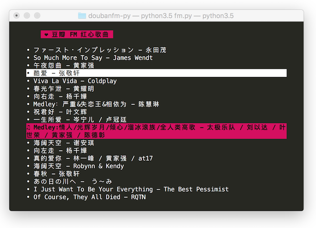

#  doubanfm-py

第三方 **豆瓣 FM** 红心频道播放器。你需要事先安装  `requests`、`urwid` 库，以及安装 [mpg123](http://www.mpg123.de/) / [mplayer](http://mplayerhq.hu/design7/news.html) / [mpv](http://mpv.io/) 三款命令行播放器中的其中一款。

**Finally，使用 `./fm.py` 命令启动程式**。*（暂不支持运行在 Windows 下）*

## 程式截图

## 按键
- **`m`：** 切换循环模式
- **`↑`、`↓`、`j`、`k`：** 上下移动光标
- **`PageUp`、`PageDown`：** 上下翻页
- **`Enter`、`Space`：** 播放所选曲目
- **`←`、`→`：** 播放下一首曲目
- **`q`、`Esc`：** 退出程式
